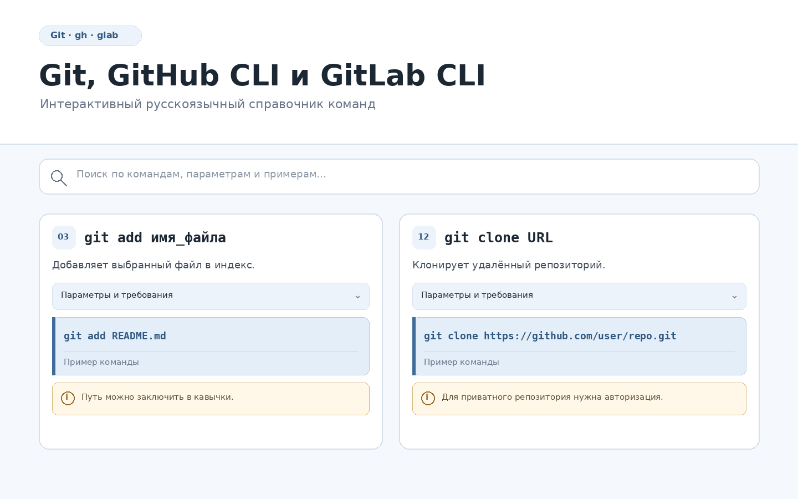

# Git, GitHub CLI и GitLab CLI — справочник команд

Интерактивный русскоязычный справочник по командам Git,
GitHub CLI (`gh`) и GitLab CLI (`glab`).

[][reference-page]

[**Открыть интерактивный справочник →**][reference-page]

## Возможности

- команды Git в алфавитном порядке;
- отдельные разделы для GitHub CLI и GitLab CLI;
- параметры и требования к каждой команде;
- примеры с пояснениями;
- полнотекстовый поиск;
- автоматическое раскрытие найденных разделов;
- подсветка совпадений;
- копирование команд в буфер обмена;
- автоматическая адаптация под светлую и тёмную тему системы.

[reference-page]: https://user201801.github.io/Netology/Part_2/git_github_gitlab_commands_ru.html